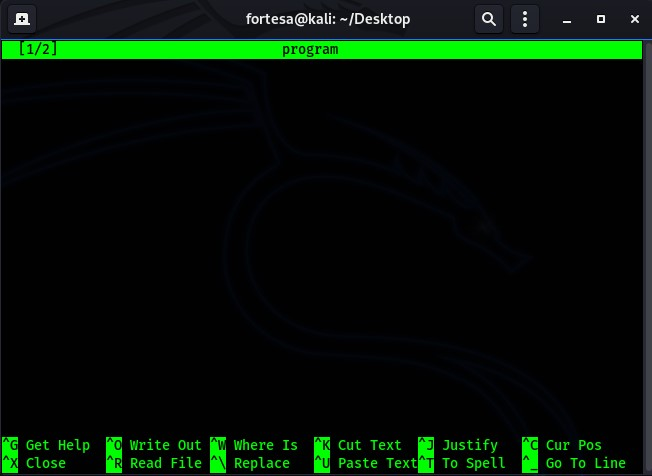

# An assignment and its solution for the course Operating Systems

## Description

Consider a system consisting of processes P1, P2, ..., Pn, each of which has a unique priority number. Write a monitor that allocates three identical line printers to these processes, using the priority numbers for deciding the order of allocation.

### Technology used

- Kali Linux - Operating System
- C++ - Programming Language

### Commands to execute the c++ file in Kali Linux

#### Step 1

> Open up your terminal and type `nano program name.cpp` and then hit enter.

for my program I have chosen name "code.cpp".

#### Step 2

> Write the program.

#### Step 3

> Hit ctrl+x then y to save your program.
> Type `g++ name.cpp -o name -lpthread` in order to compile your program.
> To execute your program type: `./name`

